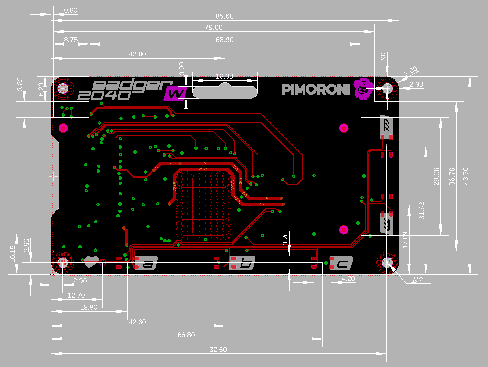

# Badge Holder

This is a design for a holder to carry both:

- The official badge from the TRGconference
- A badger 2040(W) with a battery holder

## TRG Badge Dimensions

The TRG badge has been slightly redesigned to simplify its dimensions. It is now a hexagon with all angles measuring `120 degrees`. Four sides are equal, each `52.50mm` long, and the remaining two sides are each `108mm` long. Additionally, a circular cutout with a `5mm` diameter has been added `6mm` from one end.

## Badger 2040(W) Dimensions

Exact measurements can be found in this dimensional drawing made by Pimoroni

